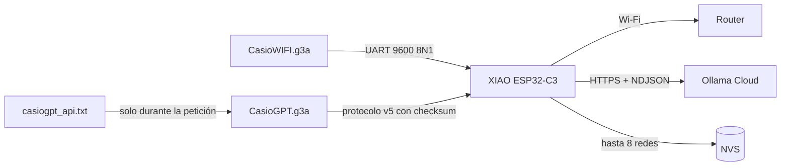
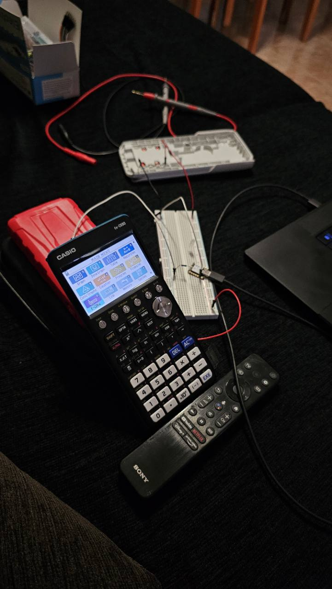
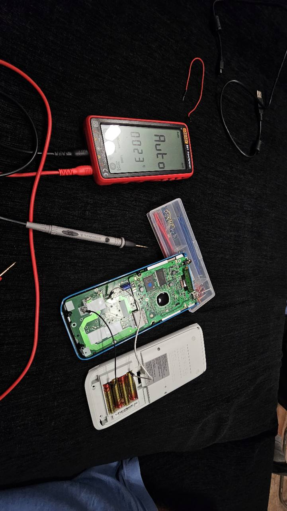
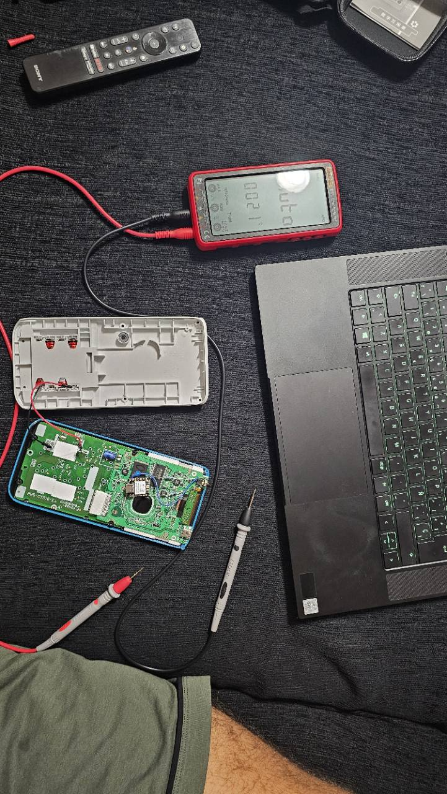
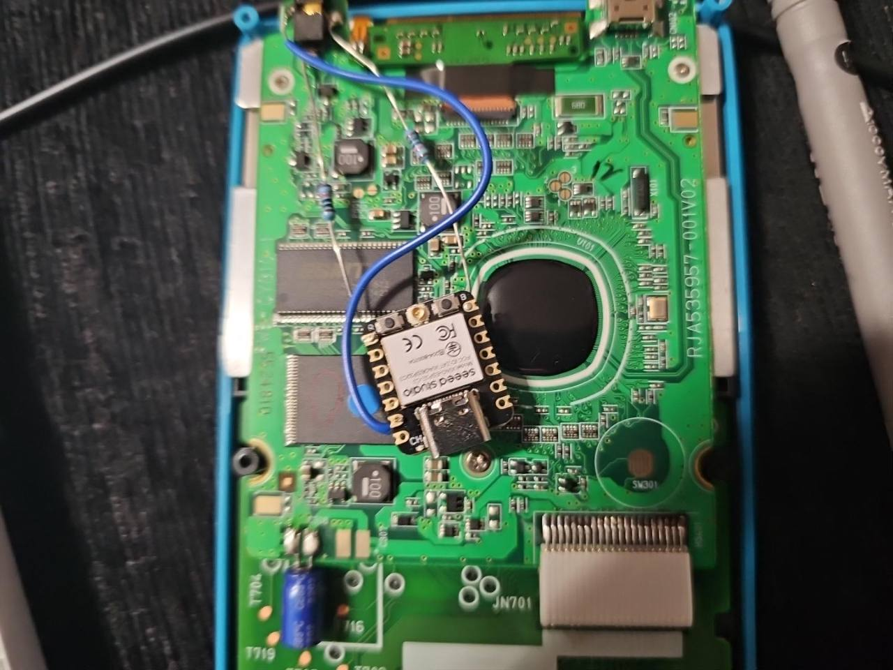
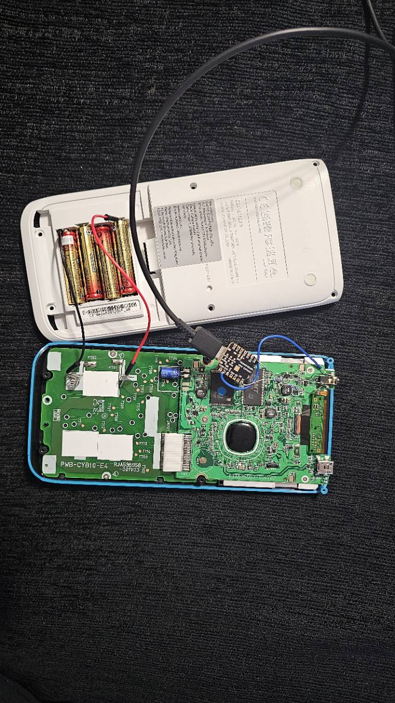
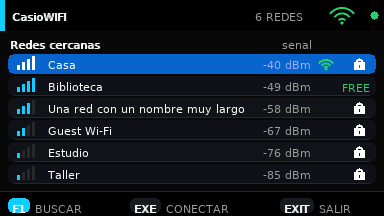
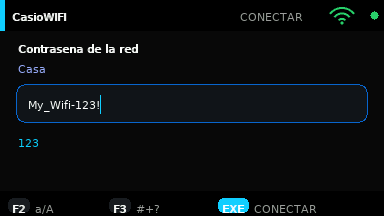
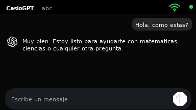

<div align="center">

# cg50-esp32mod — Casio fx-CG50 Wi-Fi + AI mod

**Mod open source que añade Wi-Fi y asistencia mediante IA a una Casio fx-CG50 usando una XIAO ESP32-C3 integrada por UART.**

*Open-source Casio fx-CG50 ESP32 mod with CasioWIFI and CasioGPT `.g3a` add-ins, UART firmware, Wi-Fi management and Ollama Cloud streaming.*

[](hardware/WIRING.md)
[](#compatibilidad)
[](LICENSE)
[](https://samilososami.github.io/cg50-esp32mod/)


*CasioGPT funcionando en la calculadora modificada: la CG50 dibuja la interfaz y la ESP32 gestiona Wi-Fi, TLS y la petición al modelo.*

</div>

> [!WARNING]
> Este proyecto requiere abrir y soldar una calculadora. Puede anular la garantía
> y una conexión equivocada puede dañar ambos dispositivos. Desconecta pilas y
> USB antes de soldar, comprueba cada señal con un multímetro y no te fíes del
> color de un cable ni de una fotografía para identificar un pad.

## Qué es

La fx-CG50 sigue ejecutando add-ins `.g3a` normales, pero delega las tareas que
no puede realizar —Wi-Fi, HTTPS y la API de IA— en una **Seeed Studio XIAO
ESP32-C3** montada en su interior. Ambos dispositivos se comunican por el puerto
serie de 3 pines de la calculadora a **9600 8N1** mediante un protocolo con
checksum, identificadores de petición, reintentos y transferencia fragmentada.

El repositorio contiene todo el software de esta modificación:

| Componente | Artefacto | Función |
|---|---|---|
| **CasioWIFI** | `CASIOWIFI.g3a` | Escanea redes, conecta a redes abiertas o protegidas y muestra el estado de la ESP32 y de Wi-Fi. |
| **CasioGPT** | `CASIOGPT.g3a` | Chat oscuro tipo mensajería, respuesta incremental, historial corto y cancelación con F6. |
| **Firmware común** | `cg50-esp32mod-esp32-merged.bin` | Puente UART, Wi-Fi/NVS, TLS y streaming desde Ollama Cloud. Sirve a las dos apps. |

Los binarios revisados están en [`dist/`](dist/) y también se publican en
[Releases](https://github.com/samilososami/cg50-esp32mod/releases).

## Arquitectura



- La interfaz, el teclado y el historial visible viven en la CG50.
- La ESP32 usa el hostname **`casio-cg50`**.
- Las redes confirmadas se guardan en NVS para reconexión automática.
- La API key de CasioGPT **no** se compila en ningún binario ni se guarda en
  NVS: se lee desde la raíz de la calculadora, se envía a RAM y después se borra.
- Ollama entrega NDJSON mediante HTTP chunked. El firmware deja que
  `HTTPClient` retire el framing HTTP y procesa cada línea JSON conforme llega;
  por eso la respuesta se ve en streaming real y no al terminar.

## Cableado exacto

En una XIAO ESP32-C3, este proyecto configura **D7 como RX** y **D6 como TX**:

```text
Casio fx-CG50                         XIAO ESP32-C3

TX del puerto serie  --[ 1 kΩ ]----> D7 / RX
RX del puerto serie  <--[ 1 kΩ ]----- D6 / TX
GND del puerto serie --------------- GND

Alimentación XIAO: USB-C propio
UART: 9600 baudios, 8 bits, sin paridad, 1 stop bit
```

La UART se cruza: **TX de la Casio va al receptor D7 de la ESP32**, y **RX de
la Casio recibe del transmisor D6**. En el conector TRS de 2,5 mm de Casio:

| Contacto del conector | Señal de la CG50 | Conexión en la XIAO |
|---|---|---|
| Punta / tip | RX | D6 / TX, mediante 1 kΩ |
| Anillo / ring | TX | D7 / RX, mediante 1 kΩ |
| Cuerpo / sleeve | GND | GND común |

En el montaje fotografiado, GND se tomó del contacto de masa del conector de
3 pines y la XIAO se alimenta por su propio USB-C. **No conectes las cuatro AAA
directamente a 3V3 ni a 5V de la XIAO.** La guía completa, con comprobaciones
antes de soldar, está en [hardware/WIRING.md](hardware/WIRING.md).

## Proceso físico del mod

Las fotografías están ordenadas por fase del trabajo. No uses los colores de
los cables como pinout: la referencia válida es la tabla anterior y las
mediciones de continuidad de tu unidad.

<table>
  <tr>
    <td width="50%" valign="top">
      <br>
      <b>1. Prototipo externo.</b> Primera comunicación con la XIAO fuera de la calculadora y alimentada por USB.
    </td>
    <td width="50%" valign="top">
      <br>
      <b>2. Identificación.</b> Calculadora abierta para localizar masa y los contactos del puerto serie antes de soldar.
    </td>
  </tr>
  <tr>
    <td width="50%" valign="top">
      <br>
      <b>3. Comprobaciones eléctricas.</b> Continuidad, tensión en reposo y ausencia de cortocircuitos con multímetro.
    </td>
    <td width="50%" valign="top">
      <br>
      <b>4. Cableado definitivo.</b> Primer plano de la XIAO instalada, con masa común y las dos líneas UART protegidas en serie.
    </td>
  </tr>
  <tr>
    <td colspan="2" align="center" valign="top">
      <br>
      <b>5. Integración final.</b> Posición interna de la XIAO y acceso a su USB-C para alimentación y flasheo.
    </td>
  </tr>
</table>

## CasioWIFI

<p align="center">
  
  
</p>

- **F1:** iniciar un escaneo; flechas para recorrer las redes.
- **EXE:** conectar a la red seleccionada. Si está protegida, abre el editor de
  contraseña; si está abierta, conecta directamente.
- **F2:** alternar minúsculas/mayúsculas en el editor.
- **F3:** selector de símbolos.
- **F6:** cancelar la operación o volver desde contraseña/error.
- **EXIT/MENU:** cerrar UART y salir limpiamente al menú.

Un candado identifica las redes protegidas y `FREE` las abiertas. La red activa
lleva su propio icono. La ESP32 conserva hasta las ocho redes conectadas más
recientemente; solo guarda una clave después de confirmar la conexión.

## CasioGPT

<p align="center">
  
</p>

1. Crea `casiogpt_api.txt` en la raíz de la calculadora y pega dentro únicamente
   tu API key de Ollama Cloud. Puedes partir de
   [`casiogpt_api.example.txt`](casiogpt_api.example.txt).
2. Conecta primero la red desde CasioWIFI.
3. Abre CasioGPT. La app valida localmente el archivo, comprueba la ESP32 y
   verifica Internet antes de mostrar el chat.
4. Escribe y pulsa **EXE**. La respuesta aparece fragmento a fragmento.

Controles principales:

- **SHIFT + ALPHA:** bloqueo alfabético de la calculadora.
- **F2:** mayúsculas.
- **F6:** cancelar una respuesta en curso.
- **Arriba/abajo:** desplazarse por la conversación.
- Se puede seguir escribiendo mientras llega la respuesta, pero no enviar otro
  mensaje hasta que termine o se cancele.

El firmware de esta versión usa `gemma4:31b`, `think: false`, temperatura `0.10`
y un máximo de 220 tokens. La disponibilidad, velocidad y cuota del modelo
dependen de Ollama Cloud. CasioGPT es el nombre del cliente; no usa la API de
OpenAI ni pretende ser una aplicación oficial de ChatGPT.

## Instalación rápida

### 1. Firmware de la ESP32

La vía reproducible compila y flashea desde el código:

```bash
./tools/flash-esp32 /dev/ttyACM0
```

También se publica una imagen fusionada en Releases. Se flashea desde offset
`0x0` con una herramienta compatible con ESP32-C3; la compilación desde fuente
es la opción recomendada porque valida la placa y las dependencias instaladas.

### 2. Add-ins de la calculadora

Copia `CASIOWIFI.g3a` y `CASIOGPT.g3a` desde `dist/` a la raíz de la unidad USB
de la CG50. En la máquina de desarrollo de este proyecto también puede hacerse
con copia verificada y backup automático:

```bash
cp casiogpt_api.example.txt casiogpt_api.txt
# Sustituye el contenido local por tu clave; el archivo está ignorado por Git.
./tools/install-calculator
```

Si `casiogpt_api.txt` no existe, el instalador copia igualmente ambos add-ins y
avisa de que CasioGPT todavía no tiene credencial.

## Compilar y probar

Requisitos principales:

- PrizmSDK en `/opt/prizmsdk-linux` o en `$FXCGSDK`.
- `arduino-cli`, core `esp32:esp32` y librería `ArduinoJson`.
- GCC/G++, Python 3 y Pillow para las pruebas/activos.

```bash
make test       # simulación UART, Wi-Fi/NVS, streaming, UI y secretos
make addins     # genera los dos .g3a
make firmware   # genera firmware de aplicación y binario fusionado
make checksums  # actualiza dist/checksums.txt
make all
```

Los scripts se pueden ejecutar tanto como usuario `kali` como `root`; al entrar
como root reutilizan de forma explícita el toolchain y la caché Arduino de
`kali`, evitando dos instalaciones divergentes. Consulta
[docs/BUILDING.md](docs/BUILDING.md) para el entorno completo y las verificaciones.

## Fiabilidad y seguridad

- Frames delimitados y checksum FNV-1a de 32 bits.
- IDs de petición para descartar respuestas antiguas y reintentos idempotentes.
- Envíos UART de hasta 8 bytes espaciados para tolerar el receptor de la CG50.
- Escaneo, conexión y HTTPS asíncronos: la UI no depende de bloquearse esperando
  a la ESP32.
- Streaming ordenado por offsets; una repetición no duplica texto.
- La clave se borra de RAM al terminar/cancelar y existe una prueba automática
  que busca credenciales en fuentes y binarios.
- Las claves Wi-Fi sí se almacenan en NVS para reconectar; en esta configuración
  NVS no está cifrada.

El protocolo completo está documentado en [docs/PROTOCOL.md](docs/PROTOCOL.md).

## Compatibilidad

Se ha desarrollado y probado físicamente en una **Casio fx-CG50** con pantalla
de 384×216 y una **XIAO ESP32-C3**. Otros modelos Prizm en color podrían aceptar
un `.g3a`, pero no se consideran compatibles sin prueba real: pueden cambiar
resolución, syscalls, distribución de memoria, puerto serie o ciclo de salida.
Incluso si arrancan, parte de la interfaz puede quedar cortada o descolocada.

## Estructura

```text
apps/CasioWIFI/             código y activos del gestor Wi-Fi
apps/CasioGPT/              código y activos del chat
firmware/casioesp_wifi/     firmware único para la XIAO ESP32-C3
hardware/WIRING.md          soldadura, señales y comprobaciones
docs/PROTOCOL.md            protocolo UART completo
tests/                      pruebas de host con mocks y sanitizadores
verification/               sonda física Wi-Fi/TLS/Ollama
dist/                       .g3a, firmware y checksums publicados
```

## Licencia

Código publicado bajo [MIT](LICENSE). Las marcas Casio, ChatGPT, Ollama y Seeed
pertenecen a sus respectivos propietarios; este es un proyecto independiente y
no oficial.
