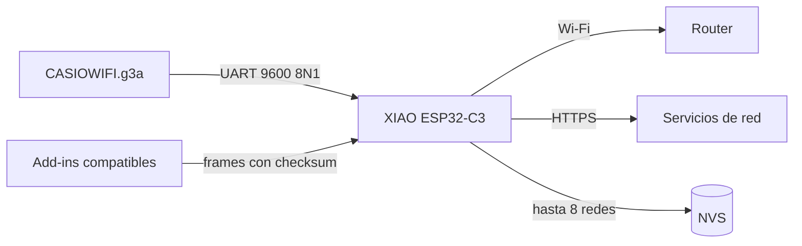

<div align="center">

# cg50-espmod

**Wi-Fi real dentro de una Casio fx-CG50 mediante una XIAO ESP32-C3 integrada.**

Mod físico, firmware UART y CasioWIFI: la base abierta para construir
aplicaciones conectadas sin convertir la calculadora en un terminal pasivo.

[](hardware/WIRING.md)
[](#compatibilidad)
[](https://github.com/samilososami/cg50-espmod/releases/latest)
[](LICENSE)
[](https://samilososami.com/tools/casio/cg50-espmod/)


*La XIAO ESP32-C3 integrada en la placa de la fx-CG50.*

</div>

> [!WARNING]
> Este proyecto requiere abrir y soldar una calculadora. Puede anular la garantía
> y una conexión equivocada puede dañar ambos dispositivos. Desconecta pilas y
> USB antes de soldar, mide cada señal y no uses el color de un cable o una foto
> como sustituto del pinout comprobado.

## Qué contiene este repositorio

La fx-CG50 sigue ejecutando add-ins `.g3a` normales. La modificación añade una
**Seeed Studio XIAO ESP32-C3** que actúa como coprocesador de conectividad: la
calculadora controla la interfaz y la ESP32 gestiona Wi-Fi, persistencia, TLS y
servicios de red.

| Componente | Artefacto | Función |
|---|---|---|
| **CasioWIFI** | `CASIOWIFI.g3a` | Escanea redes, conecta a puntos abiertos o WPA personales y muestra el estado del enlace. |
| **Firmware puente** | `cg50-espmod-esp32-merged.bin` | UART, Wi-Fi, NVS, HTTPS y protocolo extensible para aplicaciones conectadas. |
| **Mod físico** | [`hardware/WIRING.md`](hardware/WIRING.md) | Pinout, resistencias, alimentación, mediciones y montaje interno. |

CasioGPT se publica ahora como proyecto independiente, con README, capturas,
benchmark y releases propios:

<p align="center">
  <a href="https://github.com/samilososami/CasioGPT"><strong>→ Abrir CasioGPT</strong></a>
</p>

El firmware de este repositorio mantiene el protocolo necesario para
CasioGPT, pero su `.g3a`, código y herramientas específicas viven únicamente en
[`samilososami/CasioGPT`](https://github.com/samilososami/CasioGPT).

## Arquitectura



- La interfaz y el teclado viven en la CG50.
- La ESP32 usa el hostname **`casio-cg50`**.
- Las redes confirmadas se guardan en NVS para reconexión automática.
- El transporte usa checksum FNV-1a, IDs de petición y reintentos idempotentes.
- Las operaciones largas son cooperativas: la UI no queda atada a una lectura
  bloqueante de la ESP32.
- Una petición de estado o de comprobación HTTPS adelanta la reconexión de una
  red guardada y la salida a Internet se prueba hasta diez veces.

## Cableado exacto

En una XIAO ESP32-C3, el firmware configura **D7 como RX** y **D6 como TX**:

```text
Casio fx-CG50                         XIAO ESP32-C3

TX del puerto serie  --[ 1 kΩ ]----> D7 / RX
RX del puerto serie  <--[ 1 kΩ ]----- D6 / TX
GND del puerto serie --------------- GND

Alimentación XIAO: USB-C propio
UART: 9600 baudios, 8 bits, sin paridad, 1 stop bit
```

La UART se cruza: **TX de la Casio entra en D7/RX** y **RX de la Casio recibe
desde D6/TX**. En el conector TRS de 2,5 mm:

| Contacto | Señal CG50 | XIAO ESP32-C3 |
|---|---|---|
| Punta / tip | RX | D6 / TX mediante 1 kΩ |
| Anillo / ring | TX | D7 / RX mediante 1 kΩ |
| Cuerpo / sleeve | GND | GND común |

En el montaje fotografiado, la XIAO se alimenta por su propio USB-C. **No
conectes las cuatro AAA directamente a 3V3 ni a 5V de la XIAO.** Consulta la
[guía completa](hardware/WIRING.md) antes de soldar.

## El proceso físico

Las imágenes siguen el orden real del prototipo y el montaje. Las mediciones de
continuidad de tu propia unidad son la referencia válida.

<table>
  <tr>
    <td width="50%" valign="top">
      <br>
      <b>1. Prototipo externo.</b> Comunicación inicial con la XIAO fuera de la calculadora.
    </td>
    <td width="50%" valign="top">
      <br>
      <b>2. Identificación.</b> Localización de masa y contactos del puerto serie.
    </td>
  </tr>
  <tr>
    <td width="50%" valign="top">
      <br>
      <b>3. Comprobaciones.</b> Continuidad, tensión en reposo y ausencia de cortos.
    </td>
    <td width="50%" valign="top">
      <br>
      <b>4. Cableado definitivo.</b> Masa común y las dos líneas UART protegidas.
    </td>
  </tr>
  <tr>
    <td colspan="2" align="center" valign="top">
      <br>
      <b>5. Integración final.</b> Posición de la XIAO y acceso a su USB-C.
    </td>
  </tr>
</table>

## CasioWIFI

<p align="center">
  
  
</p>

- **F1:** escanear; flechas para recorrer las redes.
- **EXE:** conectar a la red seleccionada.
- **F2:** alternar minúsculas y mayúsculas al escribir una clave.
- **F3:** abrir el selector de símbolos.
- **F6:** cancelar o volver desde contraseña/error.
- **EXIT/MENU:** cerrar UART y salir al menú.

Un candado identifica redes protegidas y `FREE` las abiertas. La ESP32 guarda
como máximo las ocho redes conectadas más recientemente y solo persiste una
clave después de confirmar la asociación.

### Reparación del escaneo y reconexión

La versión actual arbitra en un único planificador los escaneos, conexiones y
reconexiones. Cancela asociaciones huérfanas antes de escanear, reintenta el
inicio de radio de forma acotada y conserva el error visible aunque llegue una
consulta de estado en segundo plano. La corrección se validó con 100 escaneos
simulados y con escaneos repetidos sobre la placa real. El informe técnico está
en [`docs/wifi-scan-repair-2026-10-08.md`](docs/wifi-scan-repair-2026-10-08.md).

## Instalación

### 1. Firmware de la ESP32

La ruta reproducible compila y flashea desde fuente:

```bash
./tools/flash-esp32 /dev/ttyACM0
```

También se publica una imagen fusionada en
[Releases](https://github.com/samilososami/cg50-espmod/releases/latest), preparada
para flashearse desde `0x0` en una XIAO ESP32-C3.

### 2. CasioWIFI

Copia `CASIOWIFI.g3a` desde `dist/` a la raíz de la unidad USB de la CG50. En
el entorno de desarrollo puede instalarse con backup y verificación SHA-256:

```bash
make install
```

El instalador solo reemplaza CasioWIFI y sus nombres antiguos; no toca
CasioGPT ni otros add-ins.

### 3. Aplicaciones opcionales

Instala CasioGPT desde su
[repositorio independiente](https://github.com/samilososami/CasioGPT/releases/latest).
El firmware puente de este proyecto sigue siendo la base compartida.

## Compilar y probar

Requisitos principales:

- PrizmSDK en `/opt/prizmsdk-linux` o `$FXCGSDK`.
- `arduino-cli`, core `esp32:esp32` y `ArduinoJson`.
- GCC/G++, Python 3 y Pillow para pruebas y capturas.

```bash
make test       # UART, Wi-Fi/NVS, firmware, UI y secretos
make addins     # genera dist/CASIOWIFI.g3a
make firmware   # genera las dos imágenes ESP32
make checksums  # hashes verificables desde la carpeta dist
make all
```

Los scripts funcionan como el usuario `kali` y con UID 0. Cuando se ejecutan
como root, la compilación se reanuda como `kali` para compartir un único
toolchain y evitar artefactos propiedad de root. Consulta
[`docs/BUILDING.md`](docs/BUILDING.md) para el flujo completo.

## Fiabilidad y seguridad

- Frames delimitados y checksum FNV-1a de 32 bits.
- IDs monotónicos para descartar respuestas antiguas.
- Escrituras UART pequeñas y espaciadas para el receptor de la CG50.
- Reintentos sin duplicar escaneos ni fragmentos.
- Recuperación de Internet en diez intentos con causa final diferenciada entre
  pérdida de Wi-Fi y fallo de red/TLS.
- Un único propietario cooperativo de la radio para SCAN, JOIN y reconexión.
- Las contraseñas Wi-Fi se guardan en NVS; en esta configuración NVS no está
  cifrada.
- El código de funciones cloud permanece en el firmware para los clientes
  compatibles, pero ninguna API key se compila en los binarios.

El protocolo completo está en [`docs/PROTOCOL.md`](docs/PROTOCOL.md).

## Compatibilidad

Desarrollado y probado físicamente en una **Casio fx-CG50** de 384×216 y una
**Seeed Studio XIAO ESP32-C3**. Otros modelos Prizm podrían aceptar un `.g3a`,
pero no se consideran compatibles sin prueba real: pueden cambiar resolución,
syscalls, memoria, puerto serie o ciclo de salida. Incluso si arrancan, parte de
la interfaz podría quedar cortada o descolocada.

## Estructura

```text
apps/CasioWIFI/             gestor Wi-Fi para la calculadora
firmware/casioesp_wifi/     firmware puente de la XIAO ESP32-C3
hardware/WIRING.md          pinout, soldadura y comprobaciones
docs/PROTOCOL.md            protocolo UART completo
tests/                      mocks, transporte, radio y renders
experiments/                sondas pasivas conservadas
dist/                       G3A, firmware y checksums publicados
```

## Proyectos construidos sobre el mod

- **[CasioGPT](https://github.com/samilososami/CasioGPT):** conversación con IA
  en streaming desde Ollama Cloud, con repositorio y releases propios.

## Licencia

Código bajo [MIT](LICENSE). Las marcas Casio, Ollama y Seeed pertenecen a sus
respectivos propietarios; este es un proyecto independiente y no oficial.
